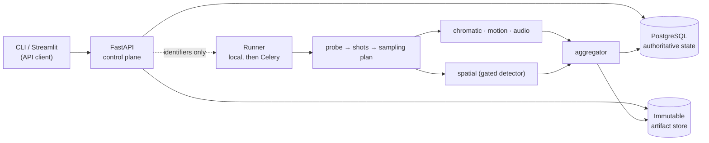
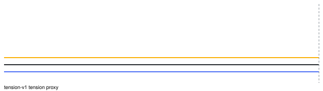
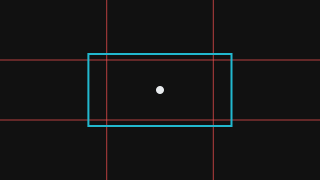

# Automated Cinematography Analyzer

Measure the editing, colour, framing, and audio of a video clip, and return a versioned report in which every number is traceable to the frames or the time range that produced it.

**Status: 0.1.0 release candidate (Phase 13).** Feature scope is frozen.
Pipeline version `0.1.0`. Default configuration hash
`66dced8dd50901cdfea31549d1395668fcca7bbc425288c3b705fe342d6304b7`.
Source: <https://github.com/edcou060/cinematography-analyzer>.
Public brief (static, no analysis): <https://cinematography-analyzer.netlify.app>.
Compose/container promotion is documented and unverified on hosts without Docker.
Next measured work lives in `docs/backlog.md`, not a Phase 14 guide.

## The problem

Film analysis tooling tends to fall into one of two traps. Either it reports numbers with no provenance, so a disputed value cannot be checked, or it dresses heuristics up as aesthetic verdicts, so a plausible-sounding label cannot be falsified. Both fail the same way: a reader cannot tell measurement from opinion.

This project takes the opposite position. Anything computed from pixels or audio samples is **measured**, carries a unit and a method version, and is reproducible from the same input and configuration. Anything derived by threshold or rule is **estimated**, carries a confidence and the evidence behind it, and is allowed to abstain. Anything a language model says is **interpreted**, is optional, is stored separately, and can never touch a metric. Anything the system could not determine is **unavailable** with a reason, never a fabricated default.

The engineering story matters as much as the metrics: strict contracts between heterogeneous CPU and GPU stages, a retryable content-addressed media pipeline, honest partial failure, and measured throughput and memory rather than claimed ones.

## What it measures

Four evidence-producing pipelines:

1. **Temporal** — shot boundaries, shot durations, cut density, transition evidence.
2. **Chromatic** — dominant palettes, perceptual lightness and contrast percentiles, lighting-key estimates.
3. **Spatial** — person detections, subject tracks, framing estimates, thirds proximity, motion evidence.
4. **Audio** — loudness, onset activity, spectral change, and the components of a configurable tension proxy.

An aggregator validates every stage output and assembles one versioned report. An optional critic turns that validated report into short prose and cannot modify it.

`docs/product-contract.md` is the binding statement of what enters, what exits, and what each word means.

## Demo workflow

```
upload clip ──► 202 + analysis_id ──► poll status ──► open report
```

1. Upload one local clip. The response is an analysis identifier within a second of the upload finishing; nothing heavy runs in the web worker.
2. Watch stage states advance. The API never holds the source video in memory.
3. Open the report: shot list, editing summary, per-shot palettes and lighting-key estimates, each linked to the frames it came from.
4. See the spatial pillar report `unavailable` with reason `detector_not_installed`, because the base install ships no licensed detector on purpose.
5. Re-submit the same clip and configuration, and watch the prior analysis be reused instead of recomputed.
6. Submit the audio-free variant, and watch the audio pillar report `unavailable` with reason `no_audio_stream` while every other pillar stays intact.

Steps 4 and 6 are the demonstration, not a caveat about it. Admitting what it does not know is the behaviour being shown.

## MVP scope

**In.** One locally uploaded SDR clip up to 1 GiB, 20 minutes, and 4096 × 2160, accepted on the strength of an `ffprobe` result rather than its file extension. Exactly one video stream; zero or one audio stream. Shot list, editing summary, and per-shot chromatic metrics for every accepted clip. Spatial, motion, audio, and tension components when their prerequisites are present, and an explicit `unavailable` reason when they are not. Evidence references for every per-shot visual metric. Reproducible measured values, idempotent stages, restart-safe job state, and recorded time, memory, and failure counts.

**Out.** Everything in the next section, plus HDR and wide-gamut input, remote URL and live-capture ingestion, image sequences, multi-video-stream files, and DRM-protected media. Rejection always names the property that failed.

Full detail, including the rejection cases and the ten success metrics, is in `docs/product-contract.md`.

## Non-goals

Explicitly not built, and not deferred-with-a-wink either — these are outside the product:

- Narrative scene understanding. Detected intervals are shots: the spans between algorithmically detected edits. Semantic grouping is a different problem, and the word `scene` is reserved for it.
- Identifying an author, classifying genre, or scoring artistic merit.
- Face recognition or actor identity.
- Training a custom foundation model.
- Replacing a non-linear editor, or frame-perfect conform.
- Feature-length, multi-tenant, cloud-scale throughput.
- Real-time analysis of a live camera feed.

Later capability upgrades, which are not MVP prerequisites: SAM 2 mask refinement, GPU decode, Triton or a separate inference service, Ray or Kubernetes execution, and a local language model for the critic.

## Architecture thumbnail



Four properties do the work here. The control plane (API, PostgreSQL, job transitions) is separate from the data plane (media, artifacts, decoding workers). Messages between processes carry identifiers and time ranges, never frames. PostgreSQL is the system of record and Redis is only transport. Shot detection is an early sequential dependency, so the pipeline plans samples first and parallelises the independent work afterwards.

The thumbnail is the **default** local-poll shape. Celery/Redis is an optional profile (`CINE_EXECUTION_BACKEND=celery`). GPU spatial, Prometheus, SAM 2, Triton, Ray, and Kubernetes are **not** in this candidate. Current vs future is labelled in `docs/architecture/system-design.md` sections 2, 5, and 18.

`docs/architecture/system-design.md` is the architectural source of truth.

## Where the original concept was corrected

The first concept was sound in ambition and wrong in several specifics. Each correction is recorded rather than quietly applied — `docs/architecture/original-blueprint-corrections.md` holds the full table, and the consequential ones became decision records:

| Original idea | Resolution | Record |
| --- | --- | --- |
| PySceneDetect returns "scenes" | Detected intervals are shots; `scene` is reserved for a future semantic feature | ADR-0001 |
| Celery and Ray | One orchestrator per profile: local runner first, Celery for the distributed profile, Ray not adopted | ADR-0002 |
| Three consumers share a frame buffer, full video processed concurrently from ingestion | Immutable sample artifacts and reference-only messages; shared memory kept as a measured optimization behind a port | ADR-0004 |
| Streamlit owns the workflow | Streamlit is an API client; PostgreSQL and the API own job state | ADR-0003 |
| A vLLM critic is the headline feature | Measurement and estimation come first; interpretation is optional, separate, and unable to alter a metric | ADR-0005 |
| Float-second timings from mixed sources | Integer milliseconds at every persisted and transported boundary | ADR-0006 |
| YOLO11 and SAM 2 from the start | A `SubjectDetector` port with the licensed adapter gated out of the base install | ADR-0007 |

Metric-level corrections — thirds proximity instead of an alignment score, framing estimates instead of box-area shot types, percentile-based lighting rules instead of mean and variance, a componentised tension proxy instead of a tension claim — are owned by `docs/metrics/metric-definitions.md` and applied in the phases that build them.

## Roadmap

One phase per conversation. Each phase has an exit gate, and the next phase does not start until it is met.

| Phase | Outcome | Guide |
| --- | --- | --- |
| 00 | Product contract and decision records | `docs/phases/phase-00-charter.md` |
| 01 | Python repository and quality gates | `docs/phases/phase-01-foundation.md` |
| 02 | Strict domain contracts and job state | `docs/phases/phase-02-contracts.md` |
| 03 | Safe upload, probe, hashing, idempotency | `docs/phases/phase-03-ingestion.md` |
| 04 | Shot detection and deterministic sampling | `docs/phases/phase-04-shots.md` |
| 05 | Chromatic vertical slice | `docs/phases/phase-05-chromatics.md` |
| 06 | Spatial composition baseline | `docs/phases/phase-06-spatial.md` |
| 07 | Motion, audio, and tension components | `docs/phases/phase-07-temporal-audio.md` |
| 08 | Aggregation, provenance, and report API | `docs/phases/phase-08-aggregation-api.md` |
| 09 | Streamlit and Plotly dashboard | `docs/phases/phase-09-dashboard.md` |
| 10 | Celery and Redis distributed execution | `docs/phases/phase-10-distribution.md` |
| 11 | Reliability, observability, and security | `docs/phases/phase-11-hardening.md` |
| 12 | Optional evidence-bounded AI critic | `docs/phases/phase-12-critic.md` |
| 13 | Benchmark, demo, and portfolio release candidate | `docs/phases/phase-13-release.md` |

`docs/release-checklist.md` holds the measurable conditions and the Phase 13 sign-off. There is no Phase 14 guide.

## Licensing and inputs

Apache-2.0; see `LICENSE` (copyright 2026 Edgar Coutiño Ocampo). The base installation stays free of dependencies whose terms conflict with that, which is why the person detector is an opt-in extra rather than a default — Ultralytics ships under AGPL-3.0 or an Enterprise licence, and that choice is a release decision, not a line in a dependency file. `THIRD_PARTY_NOTICES.md` records the posture of every gated and deferred component. ADR-0007 and ADR-0008 hold the reasoning.

No media, frames, model weights, generated reports, or databases are committed. Benchmark and demo inputs are limited to footage the owner created and synthetic clips generated by FFmpeg, so every published result rests on legally usable input.

## Getting started

[uv](https://docs.astral.sh/uv/) is the only Python prerequisite; it installs the pinned Python 3.12 itself. FFmpeg and ffprobe are required for `ingest`, `analyze`, and `make fixtures`. `doctor` still reports a missing binary as unavailable with a reason instead of failing.

```bash
git clone https://github.com/edcou060/cinematography-analyzer && cd cinematography-analyzer
make bootstrap   # uv sync --all-groups
make fixtures    # tiny gitignored clips; needs ffmpeg on PATH
make check       # lockfile check, Ruff lint and format, mypy, unit tests
make doctor      # what this installation can currently do
uv run cine-analyzer ingest fixtures/video/two_color_cut.mp4
uv run cine-analyzer analyze fixtures/video/two_color_cut.mp4 --dry-run
make run-dashboard   # Streamlit client; needs the API process
```

### Dashboard

The Streamlit UI is an HTTP client. It does not hold database credentials or import workers.

```bash
# terminal 1 — control plane (needs CINE_DATABASE_URL)
make migrate && make run-api
# terminal 2 — local worker
make run-worker-cpu
# terminal 3 — UI
make run-dashboard
```

Click a detected shot or a tension-proxy point to seek the local upload. Streamlit does not report the playhead back, and seek is whole seconds. Composition overlay is a schematic from shot-median coverage/height plus thirds/centre guides, not a detector box on a decoded frame.





Visual QA checklist: `docs/dashboard/visual-qa.md`.

### Docker Compose (API + workers)

Requires a Docker daemon. Not executed on the Phase 13 documentation host.

```bash
docker compose build --pull
docker compose up -d postgres redis migrate api worker-cpu
uv run pytest tests/system -q   # needs CINE_SYSTEM_SMOKE=1 or a live API
```

The dashboard is not a Compose service. Point it at the published API:

```bash
export CINE_API_PUBLIC_URL=http://127.0.0.1:8000
make run-dashboard
```

Stop with `make compose-down`. Copy `.env.example` to `.env` for local overrides; never commit secrets.

### Benchmark (CPU-core synthetic corpus)

```bash
make fixtures
make benchmark
# or:
uv run cine-analyzer benchmark --manifest fixtures/benchmark/manifest.yaml \
  --output build/release-benchmark.json --profile
uv run cine-analyzer validate-benchmark build/release-benchmark.json
```

Host recorded 2026-09-07: `macOS-13.5-arm64-arm-64bit python=3.12.7`.
JPEG cache on. Commit field `uncommitted`. RTF milli = `wall_ms * 1000 / duration_ms`
(1000 ≈ real-time). Peak RSS on macOS is bytes.

| Clip | Cold wall_ms | Cold RTF milli | Warm wall_ms | Warm RTF milli | Peak RSS MiB |
| --- | ---: | ---: | ---: | ---: | ---: |
| two_color_cut | 1552 | 388 | 612 | 153 | 131 |
| no_cut | 469 | 117 | 468 | 117 | 136 |
| no_audio | 127 | 127 | 120 | 120 | 136 |
| tension_signals | 5372 | 1343 | 1010 | 252 | 279 |

These are tiny FFmpeg fixtures, not 60 s 1080p film. Full table, golden
boundaries, and the JPEG-cache optimization: `docs/operations/benchmark-baseline.md`.
Machine-readable copy: `docs/examples/release-benchmark.json`.

Validated sample report (sanitized IDs, no host paths):
`docs/examples/sample-report.json`. OpenAPI snapshot:
`tests/contract/api/openapi.json`. Timed CLI demo: `docs/demo-script.md`.

`make help` lists every target. Each one is a one-line wrapper around the tool it runs, and CI runs the same targets, so a green pipeline and a green checkout mean the same thing. Prefer the underlying commands if you like; nothing is hidden.

## Limitations and tradeoffs

SDR only. Heuristic labels are estimates. Shots are not narrative scenes. The
base install has no person detector (`detector_not_installed` is the demo, not a
bug). Tension is a proxy. The critic is optional interpretation. Synthetic
benchmarks do not predict 1080p detector-on-CPU cost. Compose was not run where
Docker is missing. Detail: `docs/operations/limitations.md`.

Tradeoffs kept on purpose: local runner before Celery; PostgreSQL over Redis as
truth; artifact IDs over shared-memory frames; in-process JSON over Prometheus;
Apache-2.0 base install over an AGPL detector by default. Revisit only with the
triggers in `docs/backlog.md`.

## Repository map

| Path | Owns |
| --- | --- |
| `AGENTS.md` | Stable repository behaviour for coding agents |
| `pyproject.toml` | Dependencies, and the configuration for Ruff, mypy, pytest, and coverage |
| `src/cine_analyzer/` | The package: settings boundary, structured logging, diagnostics, CLI, API, workers, dashboard client |
| `apps/dashboard/` | Streamlit UI (HTTP client only) |
| `tests/unit/` | Unit suite, including the lockfile licence and gating checks |
| `Makefile` | The commands CI and a developer both run |
| `.cursor/rules/00-project.mdc` | The same guardrails, applied inside Cursor |
| `docs/product-contract.md` | Supported input, report outcomes, vocabulary, caveats, success metrics, benchmark and demo inputs |
| `docs/architecture/system-design.md` | Architectural source of truth |
| `docs/architecture/decision-log.md` | ADR index and status |
| `docs/adr/` | One accepted decision per file |
| `docs/contracts/data-contracts.md` | Public schemas and versioning rules |
| `docs/metrics/metric-definitions.md` | Formulas, units, caveats, confidence |
| `docs/operations/quality-and-operations.md` | Testing and production gates |
| `docs/release-checklist.md` | Measurable release conditions and Phase 13 sign-off |
| `docs/demo-script.md` | Timed 3–5 minute CLI/dashboard demonstration |
| `docs/backlog.md` | Work gated on measured revisit triggers |
| `docs/examples/` | Sample report, CycloneDX SBOM, release benchmark JSON |
| `docs/operations/benchmark-baseline.md` | Hardware-qualified synthetic timings |
| `docs/operations/limitations.md` | Honest limits for this candidate |
| `docs/operations/security-scan.md` | Supply-chain scan record |
| `docs/project-state.md` | Compact handoff between conversations, 120 lines or fewer |
| `docs/phases/` | One guide per phase |
| `prompts/` | Bootstrap and task-packet prompts |

## Working on this repository in Cursor

The Markdown files in `docs/` are the operational source. The Engineering Bible PDF is the human reference; it is not loaded into a working session unless a phase asks for a specific section.

1. Start a fresh Cursor Agent chat for each phase.
2. Paste `prompts/BOOTSTRAP.md` and name the active phase.
3. Attach only the files listed under that phase's **Context budget**.
4. Let the phase finish, run its required checks, and update `docs/project-state.md`.
5. Review the diff and commit it.
6. Start a new chat for the next phase.

When implementation and documentation disagree, stop and resolve it with an ADR. Never silently reinterpret a contract.
