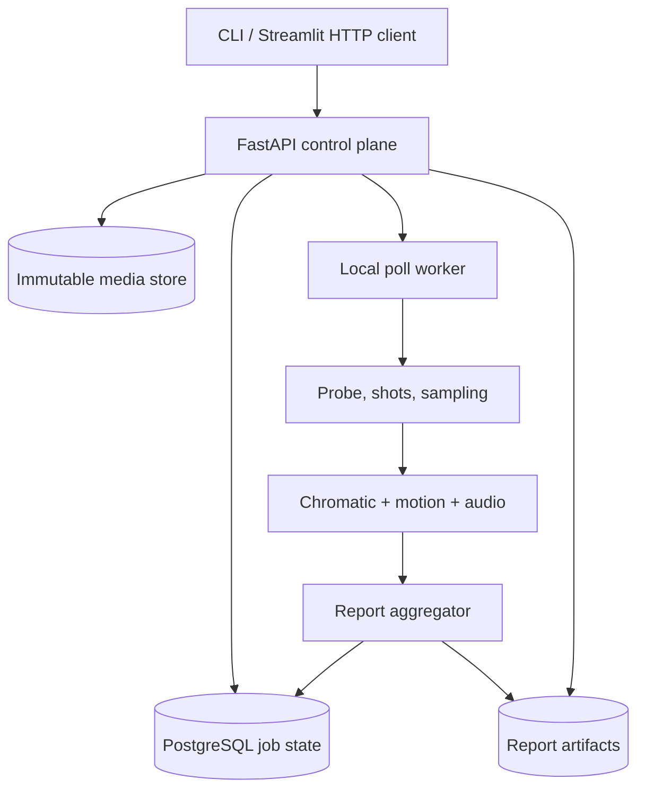
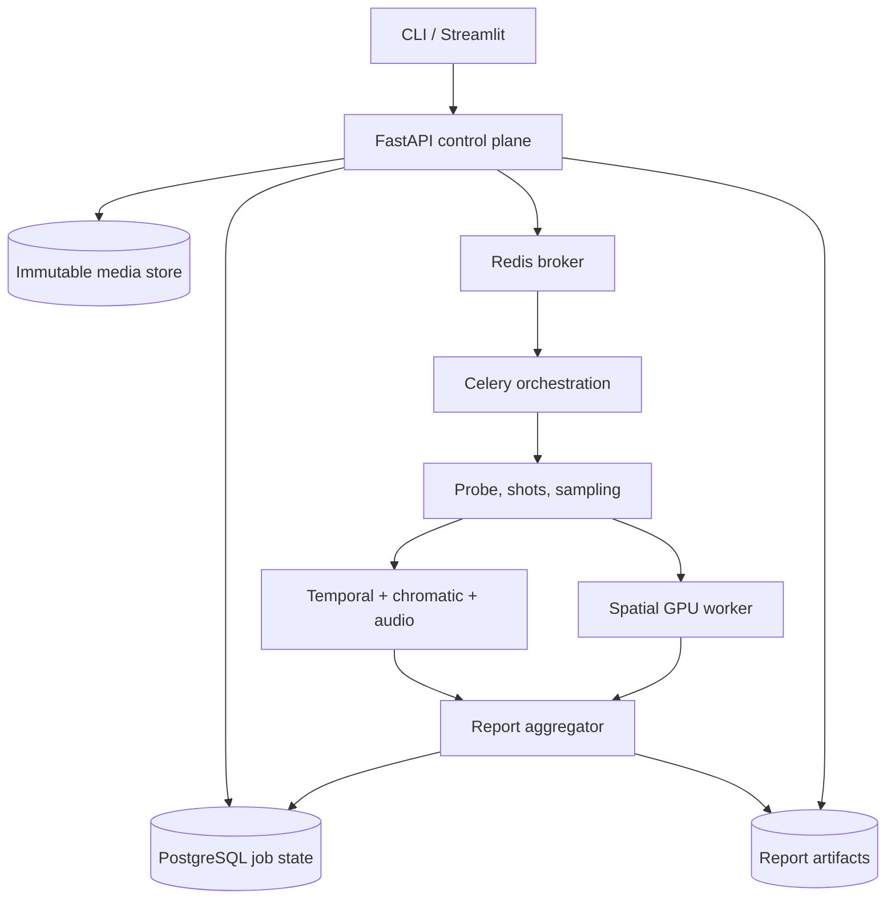
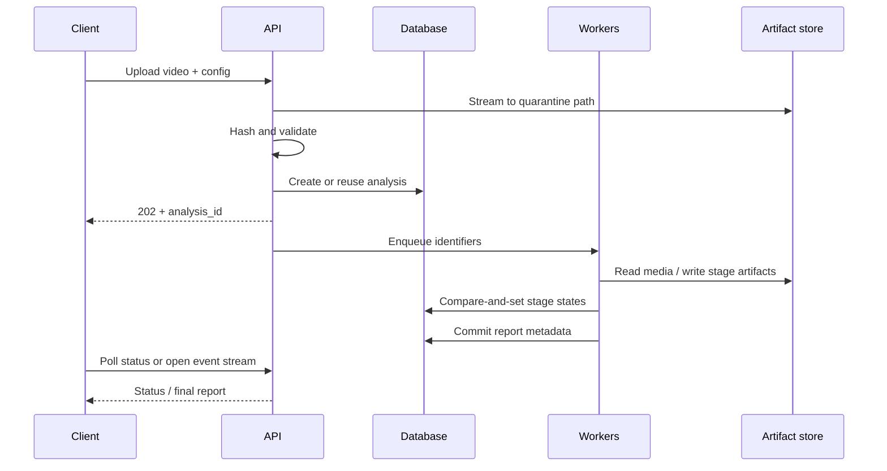
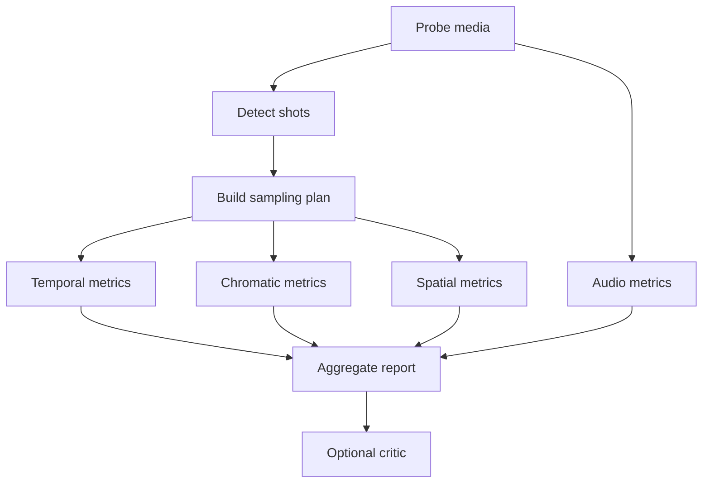
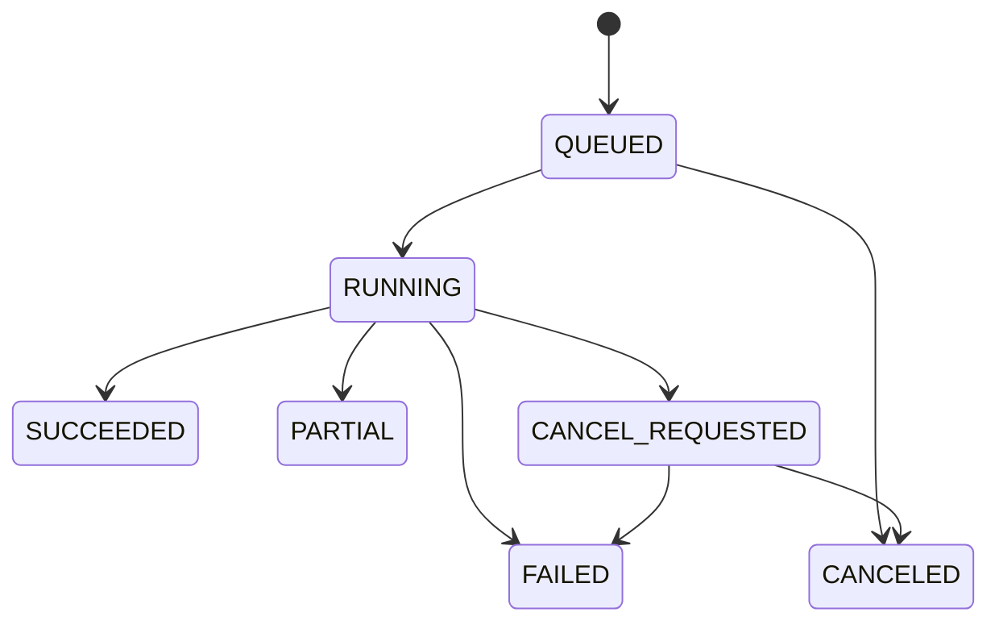

# System design

## 1. Product contract

The Automated Cinematography Analyzer accepts a video clip, produces reproducible measurements with frame/time evidence, and presents those measurements in an interactive report. It is a technical analysis tool, not an oracle of artistic quality.

The primary portfolio story is not “I called several pretrained models.” It is:

- I designed strict contracts between heterogeneous CPU/GPU stages.
- I built a retryable, observable, content-addressed media pipeline.
- I separated ingestion, orchestration, computation, persistence, and presentation.
- I measured throughput, memory, correctness, and degradation behavior.
- I represented uncertain cinematographic heuristics honestly.

### Success criteria

For a supported clip, the system must:

1. return an analysis job within one second of completing the upload;
2. preserve authoritative job state if a worker or UI restarts;
3. generate the same deterministic metrics for the same input, config, and code version;
4. provide evidence frame IDs/time ranges for every per-shot visual metric;
5. expose partial failure without fabricating missing values;
6. serve a complete report without loading the original video into application memory;
7. measure wall time, stage time, peak memory, failures, and cache hits.

### Explicit non-goals for the MVP

- Narrative scene understanding.
- Director identification, genre classification, or aesthetic quality scoring.
- Face recognition or actor identity.
- Training a custom foundation model.
- Frame-perfect NLE replacement.
- Feature-length, multi-tenant cloud scale.
- Real-time live-camera analysis.
- SAM 2, Triton, Kubernetes, Ray, or NVDEC as prerequisites.

## 2. Recommended architecture

**This release (current).** Default execution is FastAPI plus a local poll
worker. PostgreSQL is job truth. The CLI can use disposable SQLite. Streamlit is
an HTTP client. Spatial backends are `none` and `fake`. Observability is
in-process JSON (`GET /metrics`). The critic is `none` by default.



**Optional distributed profile (implemented, not default).** Redis transports
JSON `StageCommand` messages. Celery CPU workers listen on CPU queues including
`critic`. A GPU worker exists behind the Compose `gpu` profile and is unused in
the base install.



**Not in this release:** SAM 2, Triton, Ray, Kubernetes, NVDEC, Prometheus,
OpenTelemetry, Ollama SDK, vLLM.

This design intentionally separates the **control plane** from the **data plane**:

- The control plane is FastAPI, PostgreSQL, job transitions, configuration, and report retrieval.
- The data plane is the media/artifact store and the workers that decode or analyze media.
- Redis transports small task messages. It does not carry frames and is not the system of record.

### Why the original shared-memory fan-out is not the baseline

A single shared-memory frame buffer is attractive on one workstation but creates tight coupling, backpressure deadlocks, lifecycle complexity, and no clean path to multi-host execution. It also tempts the broker to become a frame transport.

The baseline uses a **probe -> shot detection -> sampling plan -> immutable artifact** flow. Downstream workers receive identifiers and time ranges, then read the exact artifacts they need. A later single-node optimization may implement a `FrameStore` backed by shared memory, but the public worker contracts do not change.

## 3. Architectural decisions

### AD-01: Shots, not narrative scenes

PySceneDetect returns timecode intervals created from visual transitions. The domain calls them `Shot` and `ShotBoundary`. The user interface may explain that a “shot” is the interval between detected edits. The word `scene` is reserved for a future narrative grouping feature.

### AD-02: One orchestration stack per deployment

The MVP uses an in-process local runner. The distributed profile uses Celery with Redis. Ray is an alternative future execution backend, not a second orchestrator running beside Celery. This keeps task ownership, retry semantics, and observability understandable.

### AD-03: Artifact references cross process boundaries

Workers exchange `video_id`, `analysis_id`, `shot_id`, time ranges, config hash, and artifact URIs. They never serialize OpenCV frames, NumPy arrays, PyTorch models, or full analysis reports through Redis.

### AD-04: Strict versioned contracts

All external and cross-stage Pydantic models reject unknown fields. Every stored result includes `schema_version`, `pipeline_version`, `method_version`, configuration hash, and provenance. Schema evolution is additive within a major version; breaking changes require a new major schema and a migration/compatibility plan.

### AD-05: Measurements precede interpretation

Deterministic code owns measurements. Heuristic classification owns labels such as `LOW_KEY_ESTIMATE`. The optional LLM receives a compact validated report and writes prose only. Its output is stored separately and can be regenerated or removed without changing the analysis.

### AD-06: CPU-first vertical slice, GPU as an adapter

The first end-to-end path uses probe, shots, sampling, and chromatics. Spatial analysis is added through a `SubjectDetector` protocol. This yields a testable product before CUDA and model setup become blockers.

### AD-07: Model isolation follows measured need

For a single-user workstation, a dedicated Celery GPU worker that initializes the model once is sufficient. Triton or a separate inference service is justified only after profiling shows model concurrency, batching, or deployment independence is valuable.

## 4. End-to-end lifecycle



### Lifecycle steps

1. **Receive** - stream the multipart body to a generated quarantine path while enforcing a byte limit and computing SHA-256.
2. **Probe** - call `ffprobe` with a timeout and JSON output; validate duration, stream count, dimensions, frame-rate rational, codec, rotation, and audio presence.
3. **Deduplicate** - compute `analysis_key = sha256(video_sha256 + canonical_config_json + pipeline_version)`.
4. **Persist** - atomically create or reuse the video and analysis rows.
5. **Detect shots** - execute the pinned detector and store boundary evidence and detector statistics.
6. **Plan samples** - create deterministic frame/time requests for each pipeline; the plan itself is a versioned artifact.
7. **Extract** - produce only necessary proxies/keyframes, with the original presentation timestamp retained.
8. **Analyze** - run independent stage tasks with resource-specific queues.
9. **Aggregate** - validate stage outputs, calculate video summaries, and mark unavailable fields explicitly.
10. **Interpret** - optionally create a short evidence-bounded critique.
11. **Serve** - return summaries from PostgreSQL and larger time-series/palette/evidence data from immutable artifacts.
12. **Expire** - apply configured retention to source video and derived frames without deleting report metadata unexpectedly.

## 5. Deployment profiles

### Profile A - developer vertical slice

- FastAPI and a local runner in separate commands.
- SQLite permitted for tests and an early local demo.
- Filesystem artifact store.
- CPU-only chromatic and temporal analysis.
- Fake subject detector for contract tests; optional real detector locally.

This remains the default CLI profile in the 0.1.0 candidate. The API worker path
uses PostgreSQL. It minimizes infrastructure while preserving ports that the
distributed adapters implement.

### Profile B - portfolio production demo

- FastAPI/Uvicorn control plane.
- PostgreSQL for authoritative state.
- Optional Redis broker when `CINE_EXECUTION_BACKEND=celery`.
- Celery CPU queue; GPU queue behind the Compose `gpu` profile.
- Filesystem artifact store (S3-compatible remains a port, not the demo default).
- Streamlit consuming only HTTP endpoints (runs on the host; not a Compose service).
- In-process JSON metrics and structured logs (ADR-0022). Prometheus is not deployed.
- Docker Compose for a reproducible API/worker/postgres/redis stack when Docker is available.

### Profile C - scale experiment

- Object storage instead of shared disk.
- Multiple CPU workers and one or more GPU workers with explicit queue routing.
- Optional model service and hardware decoding.
- Load tests, fault injection, and cost/throughput comparison.

Do not implement Profile C merely to add logos to an architecture diagram. Promote a component only after a benchmark and an ADR identify the measured constraint.

## 6. Component responsibilities

### FastAPI control plane

Owns authentication if enabled, upload streaming, request validation, analysis creation, cancellation intent, status, report endpoints, and signed/streamed artifact access. It does not decode videos or initialize CV models.

### PostgreSQL

Owns videos, analyses, stage attempts, state transitions, shot summaries, report summaries, configuration snapshots, model/method provenance, and artifact metadata. The application uses compare-and-set transitions so stale workers cannot overwrite newer terminal state.

### Redis and Celery

Redis transports small commands. Celery provides delivery, routing, retries, and worker isolation. Tasks are idempotent because delivery can be repeated. A task checks the current stage lease/state before work and writes outputs atomically before committing success.

### Artifact store

Stores immutable originals (subject to retention), proxies, sample manifests, evidence frames, per-stage JSON/Parquet artifacts, and final report JSON. Production code accesses it through an `ArtifactStore` protocol with filesystem and S3-compatible adapters.

### Local runner

Implements the same stage interfaces without Celery. It is the fastest test/debug path and remains supported. Domain code must not import Celery.

### Streamlit dashboard

Uploads through the API, polls or subscribes for status, loads downsampled timeline data, and renders evidence. It has no database credentials and no direct imports from worker packages.

## 7. Pipeline DAG



Each node has a declared input contract, output contract, resource class, timeout, retry policy, method version, and degradation policy.

| Stage | Resource | Retry | Degradation |
| --- | --- | --- | --- |
| Probe | I/O + CPU | transient I/O only | fatal if media cannot be characterized |
| Shot detection | CPU sequential decode | once for transient failure | fatal for downstream per-shot work |
| Sampling | CPU + I/O | idempotent retry | fatal if no usable frames |
| Chromatic | CPU | per-shot retry | report unavailable shots; continue |
| Spatial | GPU preferred | OOM-aware retry with lower batch | mark spatial stage unavailable |
| Audio | CPU | retry if audio extraction transient | valid `NO_AUDIO_STREAM` result |
| Aggregate | CPU + DB | retry freely | wait for required terminal stage states |
| Critic | GPU/remote optional | bounded | omit prose; report remains complete |

## 8. Sampling architecture

Sampling must be explicit because each metric needs different temporal density.

### Default sample policy

- Shot detection: sequential downscaled decode of the whole clip.
- Chromatics: three deterministic samples per shot at 20%, 50%, and 80%, excluding the first/last two frames when possible.
- Composition: 2 frames/second per shot, clamped to 3-60 frames per shot.
- Motion: 4-8 frames/second from a low-resolution proxy, configurable.
- Evidence thumbnails: one representative frame per shot plus flagged extrema.
- Audio: continuous mono waveform at a fixed analysis sample rate.

The `SamplingPlan` stores requested presentation timestamps, selected decoded timestamps, frame indices when reliable, purpose tags, extraction version, and artifact IDs. Variable-frame-rate media uses timestamps as authority; frame numbers are informational.

### Keyframe extraction warning

Seeking independently for many timestamps can repeatedly decode from previous codec keyframes. Start with one ordered extraction pass per sampling density. Benchmark before adding random seeks, shared memory, or GPU decoding.

## 9. Concurrency and backpressure

### Resource pools

- `ingest`: low concurrency, bounded by disk bandwidth.
- `cpu_decode`: process pool or Celery prefork workers.
- `cpu_analysis`: chromatic/audio tasks; cap native-library threads per process.
- `gpu_spatial`: usually concurrency 1 per GPU until profiling proves safe.
- `critic`: separate queue so prose cannot delay measurements.

### Backpressure rules

1. Every in-memory queue is bounded.
2. The decoder may not outrun the slowest required consumer indefinitely.
3. Prefer on-disk immutable sampled artifacts over a large in-RAM frame backlog.
4. Set `OMP_NUM_THREADS`, BLAS/OpenCV/PyTorch thread counts deliberately to prevent process x thread oversubscription.
5. GPU batch size is configuration, recorded in provenance, and may be reduced once after OOM.
6. Per-user and global in-flight limits are enforced before accepting unbounded work.

### The GIL, stated accurately

Python threads are not categorically invalid for computer vision. Many OpenCV, NumPy, FFmpeg, and PyTorch operations release the GIL. Use threads for bounded I/O or libraries that release it; use processes for isolation and Python-heavy CPU work; use measurements instead of slogans.

## 10. Persistence model

Keep relational state small and queryable; keep heavy arrays and media in the artifact store.

### Core tables

- `videos`: identity, content hash, probe metadata, storage reference, retention state.
- `analyses`: config hash, pipeline version, overall state, progress, timestamps, failure summary.
- `stage_runs`: stage, attempt, state, lease token, worker, timing, error taxonomy, input/output artifact IDs.
- `shots`: time range, boundary confidence/score, representative evidence, summary metrics.
- `artifacts`: immutable key, media type, bytes, checksum, schema/method version, lifecycle.
- `report_summaries`: ASL, shot count, availability flags, aggregate values.
- `critique_runs`: prompt version, model identity, validated input hash, prose, status.

### Large artifacts

- Final canonical report: compressed JSON.
- Per-second or per-sample timeline: Parquet when it becomes large; JSON for the small MVP.
- Evidence thumbnails: JPEG/WebP with timestamp and source checksum metadata.
- Debug detector statistics: CSV/Parquet, retained only in debug mode.

### Atomic write protocol

1. Write to a generated temporary key.
2. Flush and compute checksum.
3. Validate by reading metadata or deserializing.
4. Promote/rename to the immutable final key.
5. Insert artifact metadata.
6. Commit the stage transition with the artifact ID in one database transaction where possible.

Orphan temporary artifacts are swept by a safe retention job.

## 11. Job state machine



Overall progress is derived from stage state and configured weights, not from arbitrary worker log messages. Stage states are `PENDING`, `LEASED`, `RUNNING`, `SUCCEEDED`, `SKIPPED`, `FAILED_RETRYABLE`, `FAILED_TERMINAL`, or `CANCELED`.

Rules:

- Terminal states never move backward.
- A retry creates a new `stage_run` attempt.
- A worker must hold the current lease token to complete a stage.
- Cancellation is cooperative and checked between bounded chunks.
- `PARTIAL` means every required dependency reached a terminal state and at least one optional stage failed.

## 12. API contract

### Endpoints

| Method | Path | Purpose |
| --- | --- | --- |
| `POST` | `/v1/videos` | Stream upload; return video metadata |
| `POST` | `/v1/analyses` | Start or reuse analysis for a video/config |
| `GET` | `/v1/analyses/{analysis_id}` | Status, progress, availability, failures |
| `POST` | `/v1/analyses/{analysis_id}/cancel` | Request cooperative cancellation |
| `GET` | `/v1/analyses/{analysis_id}/report` | Versioned report summary |
| `GET` | `/v1/analyses/{analysis_id}/timeline` | Windowed/downsampled time series |
| `GET` | `/v1/analyses/{analysis_id}/shots/{shot_id}` | Shot metrics and evidence |
| `GET` | `/v1/artifacts/{artifact_id}` | Authorized streamed artifact |
| `GET` | `/health/live` | Process liveness |
| `GET` | `/health/ready` | Required dependency readiness |

Uploads and analysis creation may be combined in the UI, but the API keeps video identity separate from analysis configuration so repeated analyses do not duplicate media.

### Response principles

- Create endpoints return `202 Accepted` for asynchronous analysis.
- Errors use a stable problem-details shape with code, safe message, request ID, retryability, and optional field issues.
- Report responses expose schema version and stage availability.
- Timelines accept `start_ms`, `end_ms`, and `max_points` to avoid multi-megabyte UI responses.
- Artifact endpoints support range requests when serving video.

## 13. Ports and adapters

Domain/application code depends on protocols, not SDKs:

```python
from collections.abc import Iterable
from typing import Protocol


class ArtifactStore(Protocol):
    def open_read(self, artifact_id: str): ...
    def put_atomic(self, *, key: str, chunks: Iterable[bytes], media_type: str): ...


class ShotDetector(Protocol):
    def detect(self, video: "VideoRef", config: "ShotDetectionConfig") -> "ShotSet": ...


class SubjectDetector(Protocol):
    def infer(self, batch: "FrameBatch") -> "DetectionBatch": ...


class AnalysisRepository(Protocol):
    def acquire_stage(self, key: "StageKey") -> "StageLease | AlreadyComplete": ...
    def complete_stage(self, lease: "StageLease", output: "ArtifactRef") -> None: ...
```

Expected adapters in this release include filesystem artifact stores, local and
Celery runners, PySceneDetect shot detector, fake deterministic detector,
SQLite/PostgreSQL repositories, and critic adapters `none` / `fake` /
OpenAI-compatible HTTP (ADR-0023). Ultralytics, Ollama, and vLLM are not
packaged. An S3-compatible store remains a port without a demo adapter.

## 14. Configuration

Configuration is validated once, canonicalized, and hashed. Do not read arbitrary environment variables deep inside metric code.

```yaml
schema_version: "1.0"
pipeline_version: "0.1.0"
limits:
  max_upload_bytes: 1073741824
  max_duration_ms: 1200000
  max_width: 4096
  max_height: 2160
shots:
  backend: pyscenedetect
  detector: adaptive
  min_shot_ms: 300
chromatic:
  samples_per_shot: 3
  max_pixels_per_shot: 50000
  clusters: 5
  random_seed: 42
spatial:
  backend: ultralytics
  checkpoint: yolo11n.pt
  sample_fps: 2.0
  person_confidence: 0.35
motion:
  sample_fps: 6.0
audio:
  sample_rate_hz: 22050
tension:
  weights: {cut_activity: 0.35, audio_activity: 0.30, motion: 0.35}
critic:
  enabled: false
```

The YAML above is a capability sketch. The released default uses
`spatial.backend: none` and `critic.enabled: false`. Secrets and deployment
endpoints live in environment/settings adapters and are never part of the hashed
analysis config. Model weight digests and runtime capabilities are recorded
separately in provenance.

## 15. Dependency strategy

Use optional dependency groups so a CPU contributor can run the core without downloading CUDA stacks or model weights.

- `core`: Pydantic, NumPy, PyAV/FFmpeg integration, PySceneDetect, OpenCV headless, scikit-learn.
- `audio`: librosa or focused audio packages selected during Phase 07.
- `api`: FastAPI, Uvicorn, SQLAlchemy, Alembic, PostgreSQL driver.
- `worker`: Celery and Redis client.
- `ui`: Streamlit and Plotly.
- `spatial`: PyTorch and detector backend.
- `sam2`: separate optional environment due to CUDA/build constraints.
- `critic`: Ollama client or vLLM/OpenAI-compatible client.
- `dev`: pytest, Hypothesis, Ruff, mypy, coverage, HTTP test client.

Commit `uv.lock`. Pin PySceneDetect below its next major boundary according to its API guidance. Record model package and weights licensing in `THIRD_PARTY_NOTICES.md`.

## 16. Licensing gate

Ultralytics' public license guidance distinguishes AGPL-3.0 use from a paid Enterprise license. Before merging a real Ultralytics adapter, choose and document one path:

1. release the entire compatible project under AGPL-3.0;
2. obtain an appropriate Enterprise license; or
3. implement a differently licensed detector through the same `SubjectDetector` port.

Do not bury this choice in a dependency file. It is a release-level architectural decision. SAM 2 also has its own code/checkpoint terms that must be recorded.

## 17. Repository layout

```text
cinematography-analyzer/
├── pyproject.toml
├── uv.lock
├── src/cine_analyzer/
│   ├── domain/          # immutable types, formulas, state rules
│   ├── application/     # use cases and pipeline stage services
│   ├── ports/           # protocols
│   ├── adapters/
│   │   ├── media/
│   │   ├── persistence/
│   │   ├── artifacts/
│   │   ├── vision/
│   │   └── critic/
│   ├── api/             # FastAPI routes/dependencies
│   ├── workers/         # Celery entrypoints and routing
│   ├── cli/
│   └── settings.py
├── apps/dashboard/      # Streamlit client; HTTP only
├── migrations/
├── tests/
│   ├── unit/
│   ├── contract/
│   ├── integration/
│   ├── golden/
│   └── performance/
├── fixtures/            # tiny generated/licensed clips only
├── docs/
│   ├── adr/
│   ├── architecture/
│   ├── contracts/
│   ├── metrics/
│   ├── operations/
│   └── project-state.md
├── scripts/
├── docker/
├── compose.yaml
└── Makefile
```

The layout is a target, not permission to create empty packages. Each phase adds only the paths it uses.

## 18. Evolution triggers

| Upgrade | Add only when |
| --- | --- |
| SAM 2 | bounding boxes materially contaminate palette/motion metrics and a measured evaluation shows masks improve them |
| NVDEC | decode is the dominant wall-time fraction on supported NVIDIA hardware |
| Triton | several concurrent inference clients need batching/versioned serving |
| Ray | workload scheduling/object locality cannot be expressed cleanly through the chosen Celery architecture |
| Kubernetes | one-host Compose deployment no longer meets availability or scaling goals |
| Parquet timelines | JSON timeline size/query cost exceeds the response budget |
| WebSocket/SSE | polling creates measurable latency/load or a richer live UX is required |

## 19. Architecture definition of done

- A 60-second fixture traverses upload to report through the local runner.
- Restarting the API does not lose job state.
- Repeating the same request returns the same analysis or a new explicitly forced version.
- A failed optional stage yields a valid partial report.
- Queue payloads remain below the documented size ceiling.
- Every report metric names its method version and evidence.
- The dashboard uses HTTP only.
- Profiling identifies the top three costs before any scale-only component is added.
